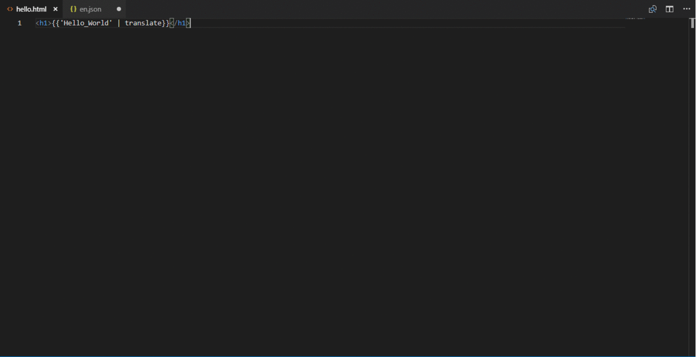
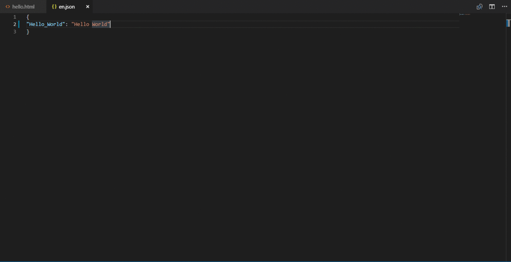

# angular-translator README

A VS Code extension to internationalize hard-coded strings in html file and build up the en.json file for Angular Projects. 

## Features

Supported Features:

* Select the string to internationalize ,which adds translate pipe to it.
* Make the corresponding entry of the selected strinf in en.json file, with a maximum key lenght of 5 words. 

> Tip: Many popular extensions utilize animations. This is an excellent way to show off your extension! We recommend short, focused animations that are easy to follow.

## Requirements

There should be an **i18n** folder inside the **src** folder with an **en.json** File.

## Known Issues

The extension will not work if the requirement specified above is not met. **It will not create a file automatically in case it is not found.**

## Release Notes

### 0.0.1

Initial release of Angular-Translator

The first release focused on providing a simple semi-automated solution to internationalize all hard coded strings in your angular app for English Language.
**Enjoy!**
